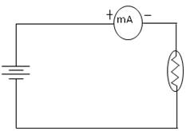
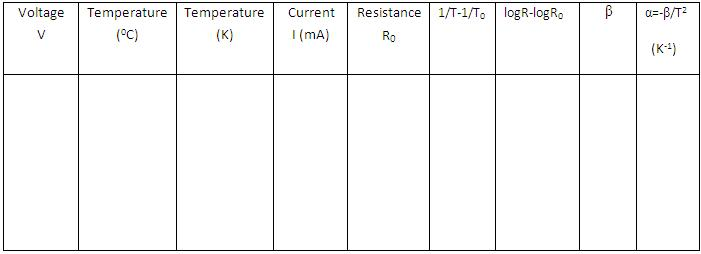

## Procedure

### Components
 

Thermistor,rheostat,voltmeter,multimeter,oil bath arrangement.

  

 

  <h3>For Real Lab</h3>

- Connections are made as shown in the figure.
- Place the thermistor in an oil bath using the heating arrangement.
- Note the room temperature (<em>T0</em>).
- Turn on the power supply and fix it to a constant voltage.
- Note the current readings using a digital multimeter or a milliammeter.
- Corresponding resistance is found using the equation:
- <strong> $R = \frac{V}{I}$ </strong> and is noted as <strong>R0</strong>.
  

- Vary the temperature of the oil bath using the heating arrangement.
- Note the current readings at regular temperature intervals.
- Corresponding resistances <strong>R</strong> are found using the same equation.
  

- From the readings, <strong>logR - logR₀</strong> and <strong>1/T - 1/T₀</strong> are calculated.
- Value of <strong>β</strong> is calculated using the equation:  

<strong> $\beta = \frac{\log R - \log R_0}{\frac{1}{T} - \frac{1}{T_0}}$ </strong>
  
- Temperature coefficient of resistance is found using the equation:
<strong> $\alpha = -\frac{\beta}{T^2}$ </strong>

- Repeat the experiment for another voltage.

  <h3>For Simulation</h3>

- Click on <strong>‘Show Circuit Diagram’</strong> to display the circuit.
- Place the mouse pointer over the components and click to drag wire.
- After connecting the components, click on the <strong>‘Power On’</strong> button in the variables region 
- to start and maintain a constant voltage.

- Select the desired room temperature and choose any thermistor from the drop-down menu.
- The corresponding current reading is shown in the milliammeter.

- Resistance for that voltage value is calculated using the equation:
<strong>$R = \frac{V}{I}$</strong>

- Increase the temperature using the slider shown in the variables region.
- Repeat the experiment for different voltage values and different thermistors.

### Observations

  <h2>Result</h2>

  

    The material constant of thermistor, <strong>$\beta$</strong> = ________
  

  

    The temperature coefficient of thermistor, <strong>$\alpha$</strong> = ________ (K-1)
  

