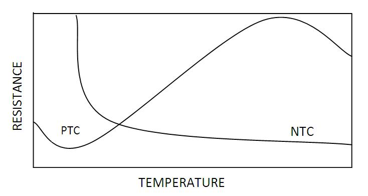
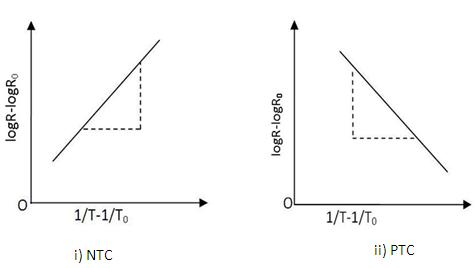

## Theory

  

    A thermistor is a type of resistor whose resistance strongly depends on temperature. The word thermistor is a combination of the words <strong>“thermal”</strong> and <strong>“resistor”</strong>.
  

  

    A thermistor is a temperature-sensing element composed of sintered semiconductor material and sometimes a mixture of metallic oxides such as Mn, Ni, Co, Cu, and Fe, which exhibits a large change in resistance proportional to a small change in temperature. Pure metals have a positive temperature coefficient of resistance, alloys have nearly zero temperature coefficient of resistance, and semiconductors have a negative temperature coefficient of resistance.
  

  
<strong>Thermistors can be classified into two types:</strong>

  <ul>
    <li><strong>Positive temperature coefficient (PTC) thermistor:</strong> Resistance increases with an increase in temperature.</li>
    <li><strong>Negative temperature coefficient (NTC) thermistor:</strong> Resistance decreases with an increase in temperature.</li>
  </ul>
  

    The thermistor exhibits a highly non-linear characteristic of resistance vs. temperature.
  

  

    <strong>PTC thermistors</strong> can be used as heating elements in small temperature-controlled ovens.
    <strong>NTC thermistors</strong> can be used as inrush current limiting devices in power supply circuits.
    Inrush current refers to the maximum, instantaneous input current drawn by an electrical device when first turned on.
    Thermistors are available in a variety of sizes and shapes; the smallest in size are the beads with a diameter of 0.15mm to 1.25mm.
  

  

    There are two fundamental ways to change the temperature of a thermistor: internally or externally.
    The temperature of a thermistor can be changed externally by altering the temperature of the surrounding media,
    and internally by self-heating resulting from a current flowing through the device.
  

  

    The dependence of the resistance on temperature can be approximated by the following equation:
  

$$R=R_0e^{\beta \left( \frac{1}{T} - \frac{1}{T_0} \right)}...............(1)$$

    <em>R</em> is the resistance of the thermistor at the temperature <em>T</em> (in K)  
    <em>R0</em> is the resistance at a given temperature <em>T0</em> (in K)  
    <em>β</em> is the material-specific constant

    The material-specific constant of an <strong>NTC thermistor</strong> is a measure of its resistance at one temperature 
    compared to its resistance at a different temperature. Its value may be calculated by the formula shown below 
    and is expressed in degrees Kelvin (°K).
  

  

    Differentiating equation (1) with respect to <em>T</em>, we get:
  

  $$\frac{dR}{dT}= -\frac{R\beta}{T^2}$$

$\text{and }\alpha=-\frac{dR}{RdT}$ is the temp coefficient of resistance.

Taking log of (1) and simplifying we get,

$$\beta = \frac{\log R - \log R_0}{\frac{1}{T} - \frac{1}{T_0}}................(2)$$

and so $\alpha=-\frac{\beta}{T^2}................(3)$

A graph plotted with $\log R- \log R_0$ in Y axis and $\frac{1}{T}-\frac{1}{T_0}$ In X-axis for NTC and PTC is shown below. The slope of the graph gives the value of <strong>&beta;</strong>.

  
